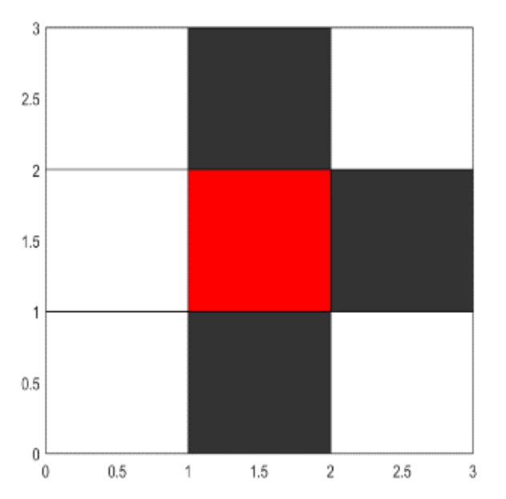
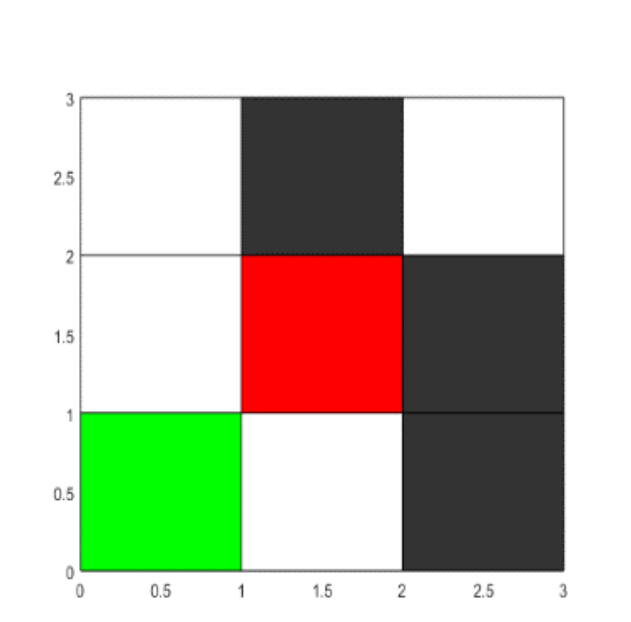
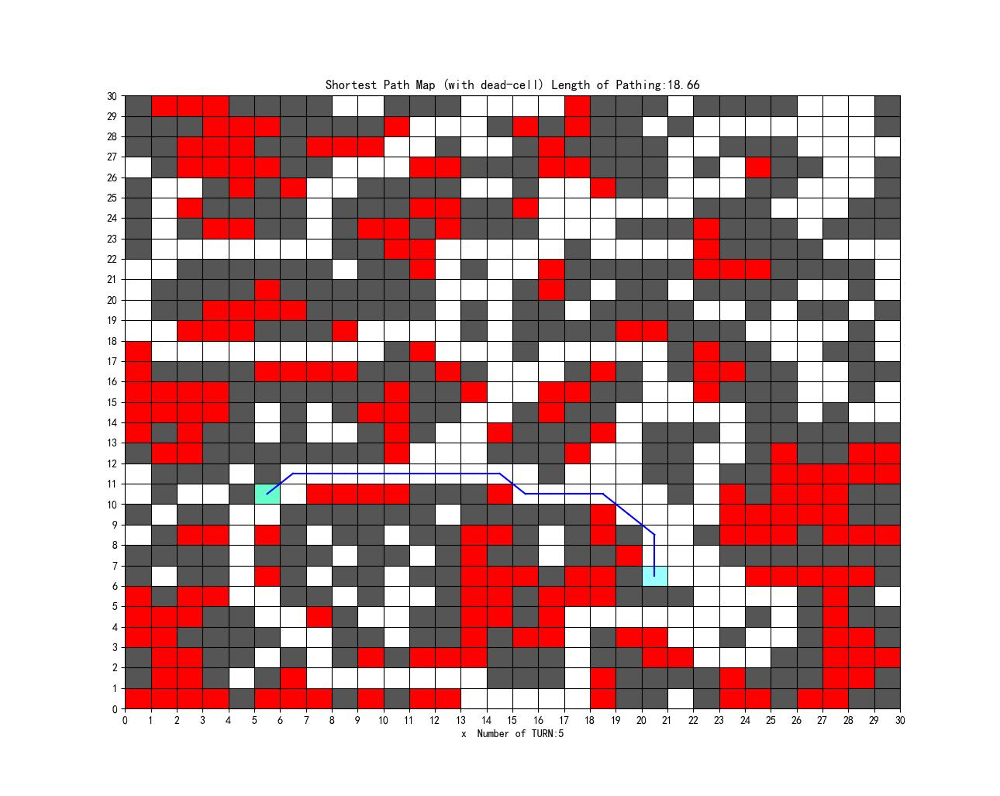
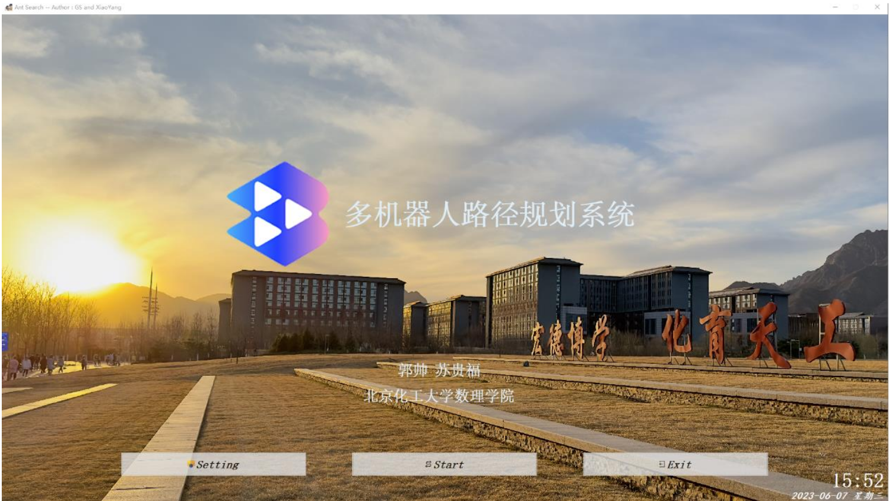
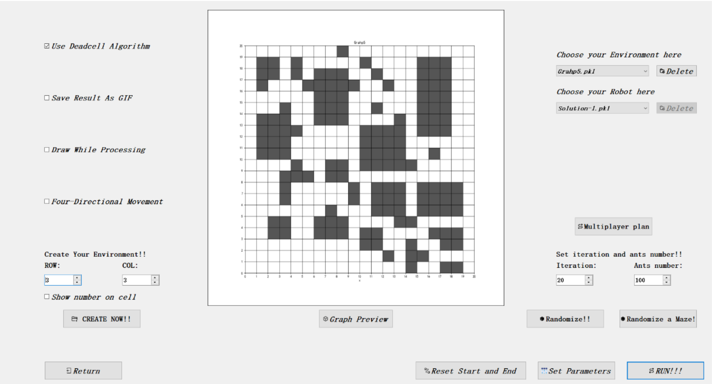
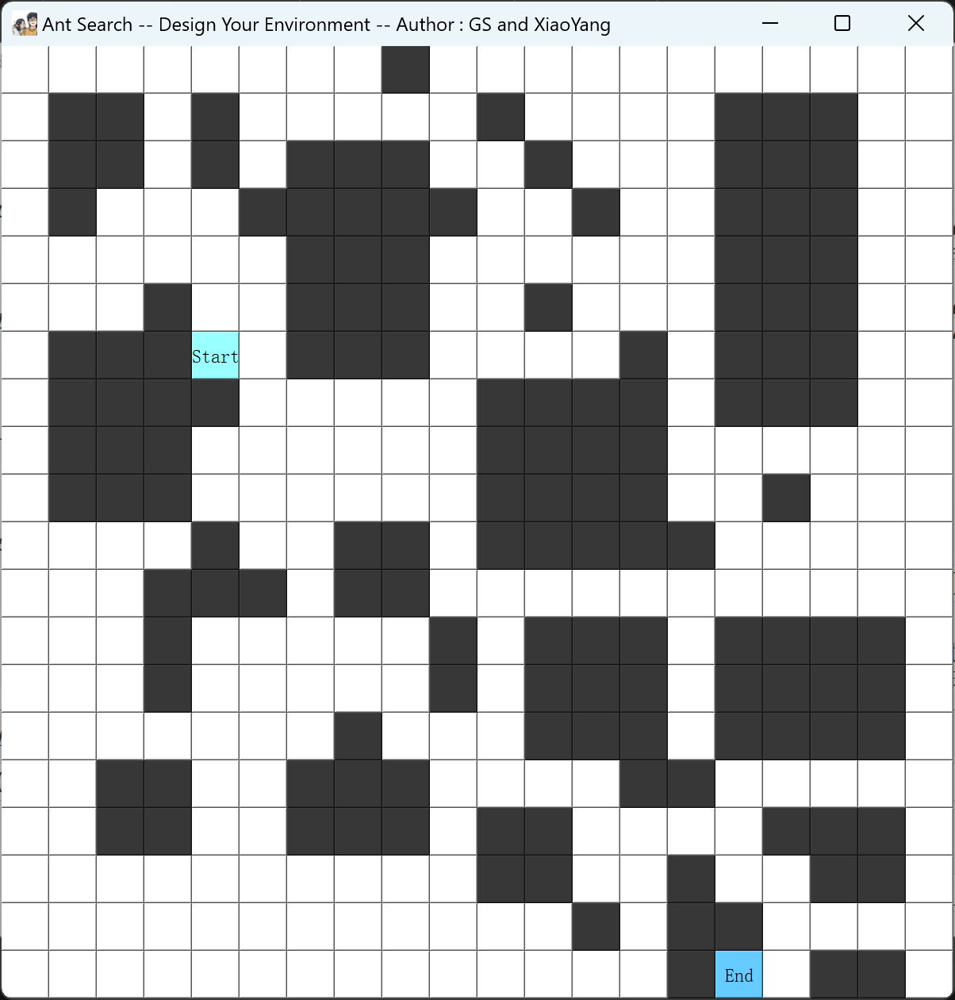

# 🌟 多机器人路径规划系统 - Dead-Cell算法与PyQt5 GUI实现

## 🚀 项目概述

本项目实现了一个基于**Dead-Cell算法**的多机器人路径规划系统，结合**PyQt5 GUI**提供了直观的用户交互界面。系统支持单机器人和多机器人协同路径规划，具备高效的搜索算法和实时的冲突检测能力。

---

## 🌟 核心创新 - Dead-Cell算法

### 🧠 算法亮点

- **混合蚁群优化算法**：动态调整信息素权重（α=1.2-2.0）和启发因子（β=2.5-5.0），确保路径规划的高效性和准确性。
- **Dead-Cell剪枝算法**：通过无效点剪枝，显著提升搜索效率。
- **时空解耦避碰策略**：支持最多9个机器人协同规划，冲突检测响应时间<10ms。

### 🎨 算法原理示意图

#### 无效点理论判断规则一
当在任意3x3栅格地图中出现了如下图所示情形，即待判断点三个方向皆为不可行栅格时，该点被判断为无效点。



#### 无效点理论判断规则二
当任意3x3栅格地图中出现下图所示情形，即待判断栅格附近存在三个不可行点，且其中两个不可行栅格斜向相邻，第三个不可行栅格只与这两栅格中的一个相邻。则该栅格为无效点，当且仅当图中的绿色栅格（左下角栅格）为可行栅格。



### ⚙️ 核心优化机制

1. **无效点动态排除**
   ```伪代码
   FOR 每一只蚂蚁 in 蚁群:
   IF 蚂蚁当前栅格满足无效点条件 THEN
       标记为障碍物
       更新邻接矩阵
   ```

2. **搜索空间压缩**
   处理前：
   
   处理后：
   

---

## 🎮 交互体验

### 🖌️ 可视化编辑器
- 支持实时障碍绘制、迷宫生成、起终点设置。
- 左键设置障碍物、清除障碍物，右键设置起始点、目标点。

### 📽️ 过程可视化
- 算法寻路过程动态演示，支持GIF录制。

### 🧠 智能环境继承
- 历史环境记忆与增量优化功能，提升规划效率。

---

## 🛠️ 工程化设计

### 🌍 跨平台部署
- 提供Python源码版和Windows可执行程序，支持多平台运行。

### 💾 配置持久化
- 参数设置自动保存与恢复（.pkl数据持久化），确保用户设置的持久性。

### 📤 多格式输出
- 结果一键导出为JPG/GIF，支持自定义保存路径。

---

## 🖥️ PyQt5 GUI

### 🏞️ 初始界面全景截图


### 🎛️ 操作界面全景截图


### 🛠️ 核心交互模块

1. **环境编辑器**
   

2. **多机控制面板**
   ```伪代码
   multi_plan():
       FOR 每个机器人路径:
           应用退避策略
       生成协同路径GIF
   ```

3. **参数调节界面**
   

---

## 🚀 快速开始

### 1. 环境创建
- 点击`CREATE NOW!!`绘制自定义障碍。
- 使用`Randomize Maze!`生成随机迷宫。
- 右键设置起点/终点（支持多目标点）。

### 2. 参数设置
| 参数项          | 推荐值  | 作用域       |
| --------------- | ------- | ------------ |
| 迭代次数        | 20-100  | 算法收敛速度 |
| 蚂蚁数量        | 50-200  | 路径探索广度 |
| 信息素权重(α)   | 1.0-2.0 | 路径累积影响 |
| 启发因子权重(β) | 2.0-5.0 | 局部最优规避 |

### 3. 典型工作流
```mermaid
graph TD
    A[环境创建] --> B{模式选择}
    B -->|手动| C[栅格绘制]
    B -->|自动| D[迷宫生成]
    C --> E[路径规划]
    D --> E
    E --> F[多机协同]
    F --> G[结果导出]
```

---

## 📊 核心功能演示

### 单机器人路径规划


### 多机器人协同


---

## 📌 高级功能

### 多机避碰策略示意图

低级机器人在遇到高级机器人时，会进行避碰处理，避免碰撞。

### 🌐 多模态环境支持

| 环境类型   | 生成方式     | 适用场景     |
| ---------- | ------------ | ------------ |
| 自定义障碍 | 鼠标绘制     | 复杂工业环境 |
| 随机迷宫   | Prim算法生成 | 仓储物流     |
| 动态障碍   | 实时编辑     | 仿真测试     |

### 配置文件管理
```
├── parameters.pkl    # <-- 算法参数配置文件
```

---

## 🚨 注意事项

### 1. 已知限制
- 最大支持81x81网格环境。
- 机器人数量上限为9个。
- 动态障碍物更新需手动刷新。

### 2. 文件管理
- 确保`*.pkl`配置文件与主程序同级。
- 修改保存路径后建议重启程序。

### 3. 多机规划限制
- 删除顺序：仅支持LIFO（后进先出）删除。
- 最大容量：同时支持9个机器人路径。

### 4. 性能优化建议
- 复杂环境建议分阶段优化：
  ```
  阶段一：迭代20次+Dead-Cell 快速剪枝
  阶段二：迭代80次 精细搜索
  ```

---
